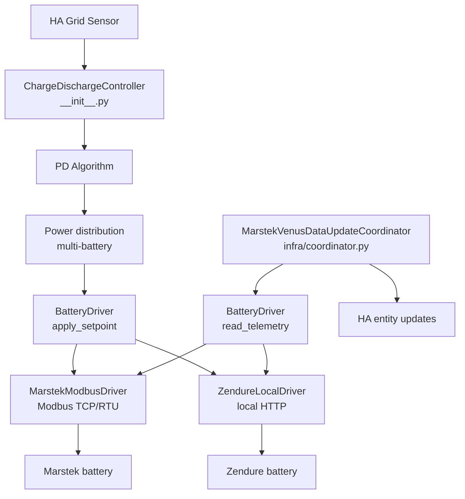

# Architecture

## Main components



The control loop and the coordinator never talk to the hardware directly: every
read and write goes through a brand-agnostic **`BatteryDriver`** (see [Hardware
drivers](#hardware-drivers) below). This is what makes the integration
multi-brand — adding a battery brand is writing a new driver, not editing the
control logic.

## Modules

The integration root keeps only the Home Assistant platform files
(`sensor.py`, `number.py`, …) and the controller. Everything else lives in
subpackages by responsibility.

| File | Main class | Responsibility |
|---|---|---|
| `__init__.py` | `ChargeDischargeController` | Main control loop (event-driven on the grid sensor + 2 s watchdog), PD algorithm, multi-battery distribution |
| `config_flow.py` | — | Multi-step configuration wizard in HA UI (brand selection, batteries, features) |
| **`drivers/`** | `BatteryDriver` | Brand-agnostic hardware abstraction — see below |
| `drivers/base.py` | `BatteryDriver`, `DriverCapabilities` | The driver contract and the static-traits dataclass |
| `drivers/marstek.py` | `MarstekModbusDriver` | Marstek Venus (v2/v3/vA/vD) over Modbus TCP / RTU |
| `drivers/zendure.py` | `ZendureLocalDriver` | Zendure SolarFlow over local HTTP |
| `infra/coordinator.py` | `MarstekVenusDataUpdateCoordinator` | Periodic telemetry polling (via the driver), entity updates |
| `infra/modbus_client.py` | `MarstekModbusClient` | Async Modbus TCP/RTU transport via pymodbus, retries with backoff |
| `infra/external_loads.py` | — | Excluded-device load adjustment and solar-surplus crediting |
| `infra/alarm_notifier.py` | `AlarmNotifier` | Alarm/fault bit-delta detection and HA persistent notification formatting |
| `infra/entity_naming.py` | — | Translation-key based entity IDs and registry migrations |
| `const/` | — | All Modbus register and entity definitions (split per battery version) |
| `pricing/engine.py` | — | Predictive charging: dynamic pricing, time slot, real-time price, SOC floor |
| `control/power_distribution.py` | — | Splits the system setpoint across active batteries |
| `control/charge_delay.py` | — | Solar charge delay |
| `control/max_soc_charge.py` | — | 100 % voltage taper / top-of-charge protection |
| `control/weekly_full_charge.py` | `WeeklyFullChargeManager` | Weekly full charge state, persistence and register-write orchestration |
| `control/active_balance_mode.py` | — | Active cell-balance measurement |
| `tracking/consumption_tracker.py` | `ConsumptionTracker` | Consumption history, daily energy accumulators, solar-timing detection, recorder backfill, daily capture |
| `tracking/balance_monitor.py` | `CellBalanceMonitor` | Post-full-charge cell voltage spread measurement and health history |
| `tracking/non_responsive_tracker.py` | `NonResponsiveTracker` | Non-responsive battery detection and 5-minute exclusion windows |
| `tracking/hourly_balance.py` | — | Hourly net-balance (Spain RD 244/2019) accounting |
| `sensors/aggregate_sensors.py` | — | System aggregate sensors (sum across all batteries) |
| `sensors/calculated_sensors.py` | — | Derived sensors (cycle count, efficiency, synthetic energy, estimates) |

## Hardware drivers

A **driver** owns all brand-specific hardware I/O — transport, connection
lifecycle, telemetry decoding and control commands — behind a single interface,
[`drivers/base.py`](https://github.com/ffunes/omnibattery/blob/main/custom_components/omnibattery/drivers/base.py)`::BatteryDriver`.
The coordinator and the control loop talk only to that interface, so they never
branch on battery brand or firmware version.

The contract is deliberately **semantic, not register-shaped**. It exposes two
operations — "give me a telemetry snapshot" and "deliver this net power" — so a
register/Modbus battery (Marstek) and a property/HTTP battery (Zendure) both fit
behind it without register addresses or HTTP paths leaking into the control
layer.

### What a driver provides

| Surface | Method / property | Purpose |
|---|---|---|
| Identity | `capabilities`, `model_label` | Static hardware traits (see below) and a display label |
| Connection | `connect()`, `close()`, `connected` | Transport lifecycle (owns the v3 single TCP slot, etc.) |
| Read | `read_telemetry(keys)`, `read_groups` | Latest telemetry as a flat `{logical_key: value}` dict; `read_groups` lets the coordinator schedule polling per register block |
| Write | `apply_setpoint(net_power_w, …)` | Command a single signed net power (+charge / −discharge); the driver translates to its own wire format |
| Write | `write_control(key, value)` | Generic entity-write path for user-facing number/select/switch entities |

`apply_setpoint` returns a `SetpointResult` carrying the applied power, whether
the write was confirmed by a readback, the measured delivered power, and a
brand-native state echo the coordinator merges into `coordinator.data`.

### Capabilities replace version checks

Each driver reports a frozen `DriverCapabilities` once; callers consult it instead
of hard-coding `if battery_version in (...)`. The control and entity layers read
these from `coordinator.capabilities`:

| Capability | Meaning |
|---|---|
| `hardware_soc_cutoff` | Hardware enforces min/max SOC itself (v2); otherwise the control layer does it in software |
| `has_force_mode` | Hardware has a distinct force/charge/discharge mode command |
| `push_telemetry` | Telemetry arrives by push rather than poll |
| `max_charge_power_w` / `max_discharge_power_w` | Power envelope the hardware accepts |
| `has_mppt_pv` | DC-coupled PV / MPPT inputs present (Venus A/D) |
| `has_alarm_registers` | Exposes alarm/fault status (Marstek v2 only) |
| `has_rs485_control` | External RS485/Modbus control mode can be toggled |
| `has_energy_counters` | Reports cumulative energy + nominal capacity; when false the integration synthesises energy from power and takes capacity from a user entity (Zendure) |
| `setpoint_confirm_reliable` | A readback reliably reflects the just-written command on the confirmation cycle |
| `actuator_latency_s` | Worst-case time for a setpoint to land and show in telemetry — drives per-driver loop pacing |

The coordinator selects the driver from the configured brand
([`infra/coordinator.py`](https://github.com/ffunes/omnibattery/blob/main/custom_components/omnibattery/infra/coordinator.py)):
`zendure` → `ZendureLocalDriver`, otherwise `MarstekModbusDriver`. The driver
also owns its version's register/entity definition lists, which the platform
setups read back instead of branching on the version string.

## Data flow

```
Grid sensor → Controller (PD) → Power distribution → driver.apply_setpoint → Batteries
                    ↑
Coordinator → driver.read_telemetry → Entity updates
```

## Polling intervals

| Interval | Period | Registers |
|---|---|---|
| `high` | 2 s | Power, SOC |
| `medium` | 5 s | Voltage, current, temperature |
| `low` | 30 s | Accumulated energy, alarms |
| `very_low` | 600 s | Device info, firmware |
